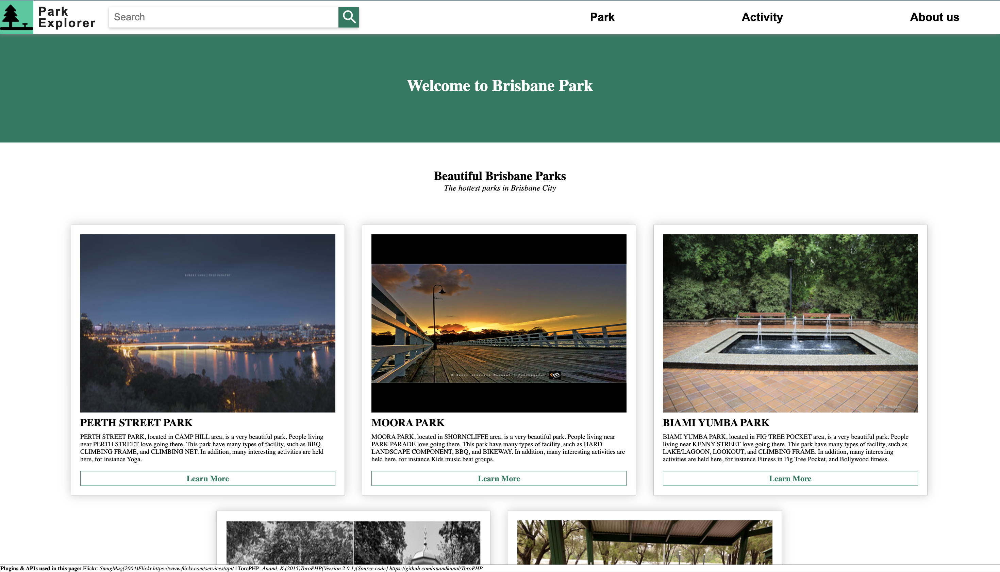
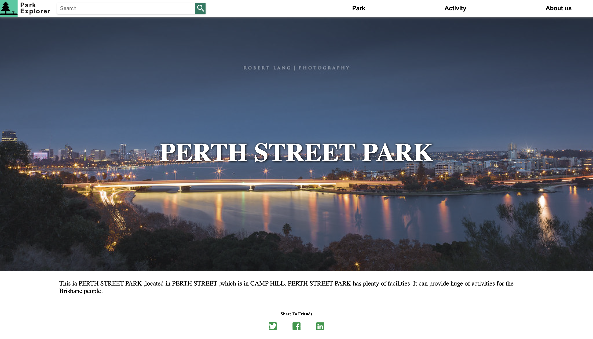
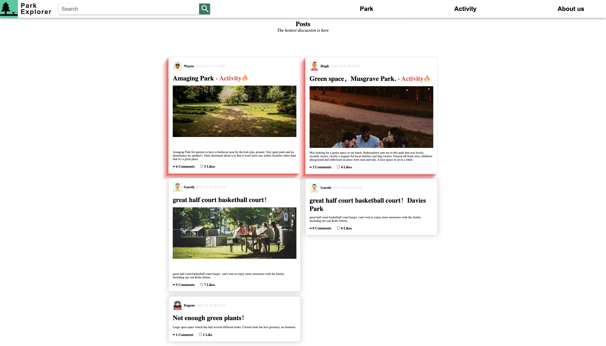
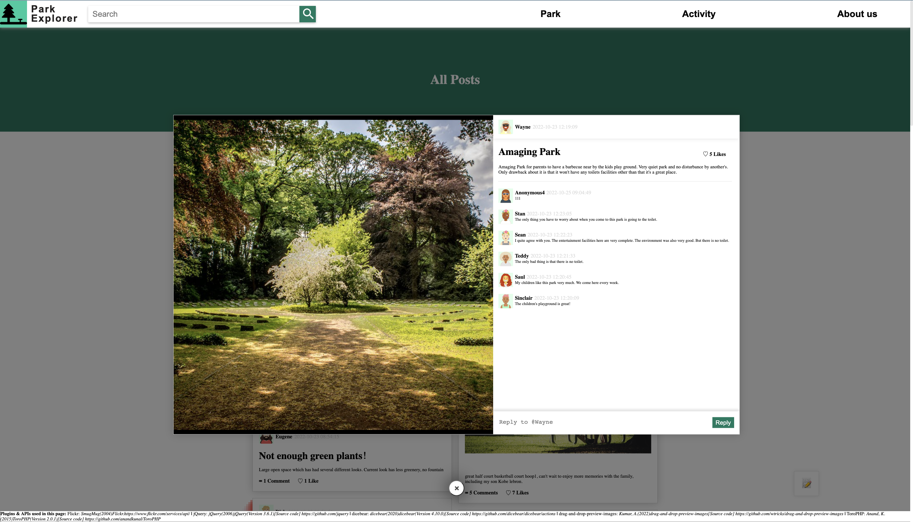
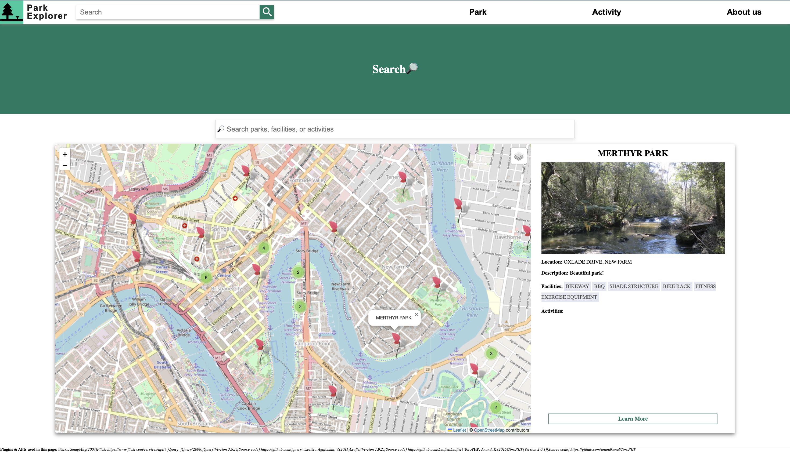

# BrisbaneParkExplorer

A website to view all parks in Brisbane as well as the activities held in the park.

## Purpose of this project

[One research](https://doi.org/10.1002/pan3.10218) from the University of Queensland found that “45% of the previous non-users of urban green space began using it for the first time during the restrictions period”, which inspired us to create a website to help increase the use of Brisbane parks to reduce the waste of public resources and also to improve people’s health.

The website targets Brisbane citizens aged from 20 to 30 who want to utilize the free greenspace infrastructure to enjoy and relax. In addition, these people are old and energetic enough to be able and willing to use modern technology, namely the website, and to interact safely with the facilities they prefer. They like to socialize and want to participate in outdoor activities.

## Datasets used

- The Parks — [Locations dataset](https://www.data.brisbane.qld.gov.au/data/dataset/park-locations)
    - gives general information about every park in Brisbane, such as the park name, the park ID, the address, and the specific longitude and latitude.
- The Park Facilities and Assets locations - [dataset](https://www.data.brisbane.qld.gov.au/data/dataset/park-facilities-and-assets)
    - provides the facility types existing in each park.
- The Events — [Brisbane parks dataset](https://www.data.brisbane.qld.gov.au/data/dataset/brisbane-parks-events)
    - a frequently updated dataset that offers detailed information about all recent activities held in the parks.

> Note that some datasets may no longer be useful.

## Implementation

This website is implemented using PHP to handle a large amount of data retrieved from the dataset. 

### Description of the files

- css: contains all the CSS files for this website
- js: contains all the JavaScript files for this website
- handlers: contains the handlers which are called after Toro recognizes the URL. The handler will then decide which view should be displayed.
- views: contains all the views, i.e. the pages.
- lib: the setup of this website, including database setup, Toro, SQL queries, and other useful methods

### APIs/frameworks used
- [ToroPHP](https://github.com/anandkunal/ToroPHP): Toro is a PHP router for developing RESTful web applications and APIs.
- [Leaflet](https://github.com/Leaflet/Leaflet): A map.
- [Leaflet.markercluster](https://github.com/Leaflet/Leaflet.markercluster): for clustering the markers on the map.
- [Flickr](https://www.flickr.com/services/api/): search for relevant images and embed them in the webpage.
- [dicebear](https://github.com/dicebear/dicebear/actions): gernate random avatar for the post.
- [jQuery](https://github.com/jquery)

## Preview

*👆🏼The home page*

*👆🏼The page for a park introduction*

*👆🏼The page for the community to post their thoughts*

*👆🏼Viewing a single post*

*👆🏼The search page*